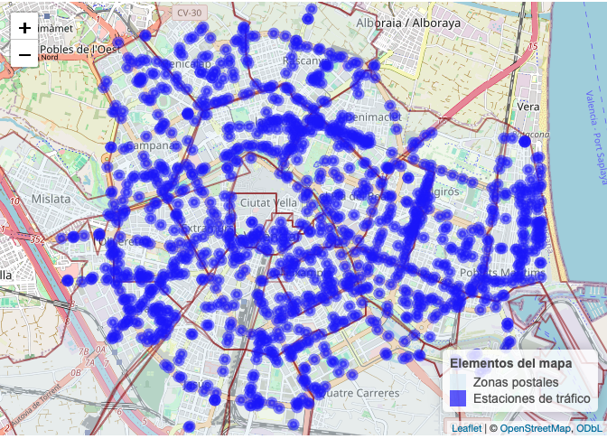
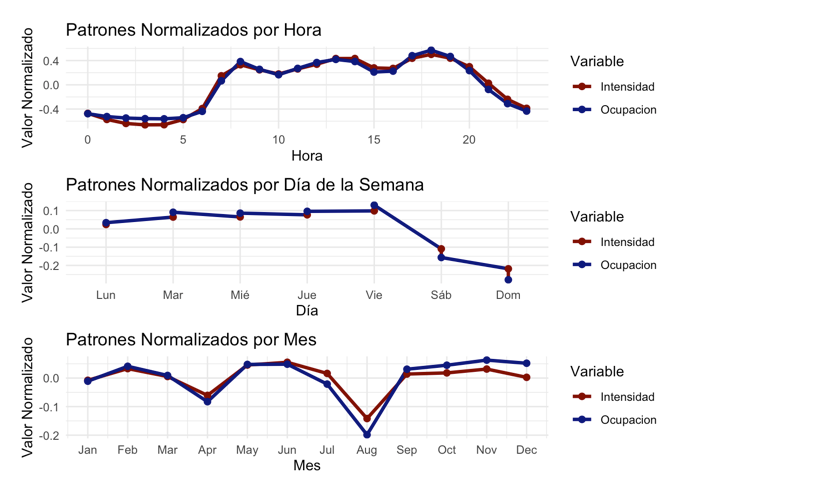
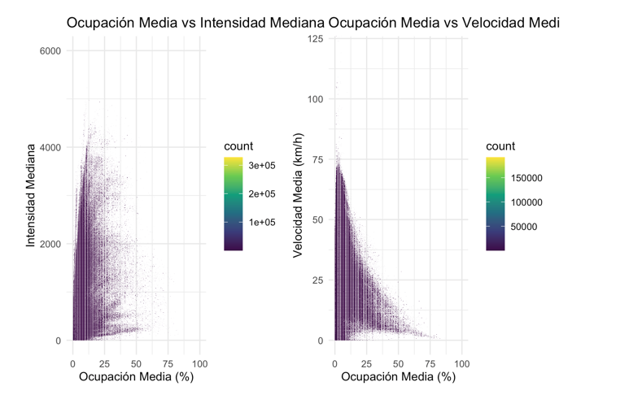
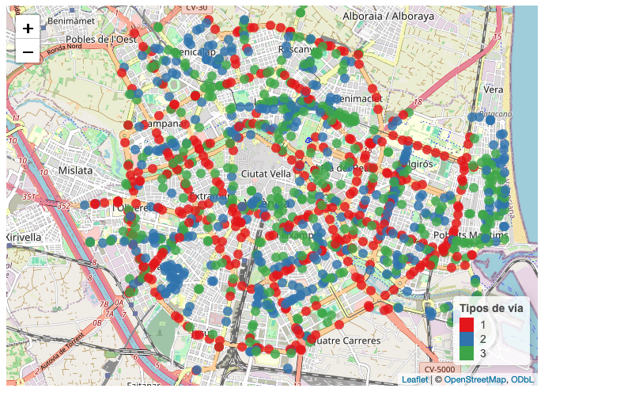
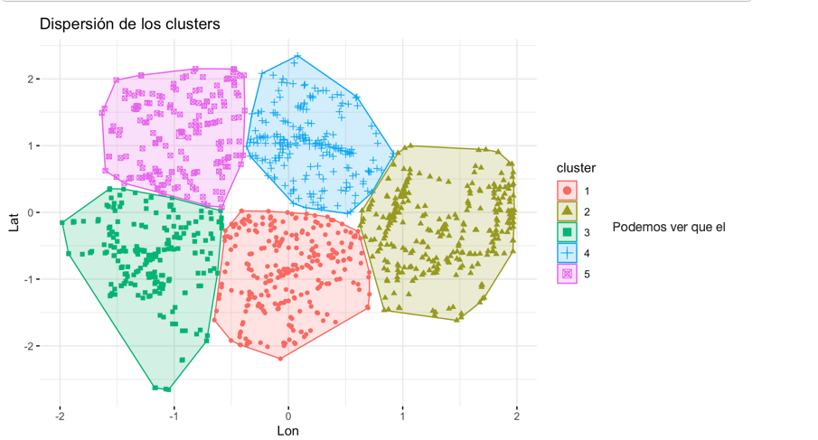

# Análisis del tráfico en Valencia (2019–2024)

Este repositorio recoge mi trabajo individual dentro del proyecto grupal **“Estudio de la calidad del aire en Valencia”** (Grado en Ciencia de Datos, UPV, curso 2024–2025).  
Mientras el proyecto completo abordaba la relación entre **contaminación atmosférica, meteorología, emisiones de inmuebles y zonas verdes**, en este repositorio se documenta únicamente la parte centrada en el **análisis del tráfico urbano** que es la que yo realice.

> **Este proyecto obtuvo la mejor calificación de la asignatura de proyecto de la promoción de Ciencia de Datos (9.9/10)**


## Descripción del trabajo

El objetivo principal de esta parte del estudio fue **caracterizar el tráfico en la ciudad de Valencia** a partir de los datos recogidos por espiras electromagnéticas, analizar sus patrones temporales (diarios, semanales y mensuales) y segmentar los tipos de vía según su comportamiento.  

Posteriormente, estos resultados se cruzaron con contaminantes atmosféricos y factores meteorológicos en el proyecto global.  
Sin embargo, en este repositorio se recopilan y explican exclusivamente las fases relacionadas con **procesamiento, exploración y análisis de los datos de tráfico**.

El siguiente mapa muestra la ubicación de las **espiras de tráfico** en la ciudad de Valencia, evidenciando su concentración en las principales vías y avenidas:

<p align="center">
  
</p>

### Principales herramientas utilizadas:  

<p align="center">
  
  
  
  
  
  
  
  
  
  
  
</p>


## Datos utilizados

Los datos de tráfico fueron facilitados por **ETRA y el Ayuntamiento de Valencia**, tras solicitud formal, ya que no son de libre difusión.  

- **Cobertura**: año 2023 completo.  
- **Granularidad original**: registros cada 5 minutos.  
- **Número de puntos de medida**: 1.129 espiras electromagnéticas distribuidas por la ciudad.  
- **Variables registradas**:  
  - Intensidad (vehículos/hora)  
  - Ocupación (%)  
  - Velocidad media (km/h)  
  - Fiabilidad de las mediciones  
  - Coordenadas geográficas (latitud, longitud)  

Para el análisis se transformaron los datos a **granularidad horaria**, generando métricas agregadas que permitieron estudiar tendencias y patrones de movilidad en Valencia.

## Análisis

El análisis realizado se ha centrado en el **tráfico de la ciudad de Valencia** durante 2023, utilizando los datos procedentes de 1.129 espiras electromagnéticas distribuidas en la ciudad. A continuación se describen los principales estudios desarrollados, cada uno de ellos documentado en un R Markdown ejecutado y compilado a HTML.

### 1. Resumen y mapa de espiras
- Representación geográfica de las 1.129 espiras de tráfico en Valencia.
- Descripción de las variables medidas por los sensores: **intensidad, ocupación, velocidad media y fiabilidad**.
- Distribución espacial: concentración en grandes vías y accesos principales de la ciudad.

Como ejemplo de los análisis exploratorios realizados en R (entre muchos otros más detallados), se muestran a continuación dos visualizaciones de distribuciones:

<p align="center">
  
  
</p>

*A la izquierda, evolución horaria, semanal y mensual de la intensidad y ocupación. A la derecha, relaciones entre intensidad, ocupación y velocidad. Ejemplos ilustrativos del análisis en R.*  


### 2. Transformación a granularidad horaria
- Conversión de los registros de 5 minutos a datos **agregados por hora**.
- Análisis de patrones temporales:
  - **Diarios**: picos en horas punta (7–8h y 18h), mínimo entre 22h–6h.
  - **Semanales**: reducción en fines de semana, repunte los viernes por salidas de la ciudad.
  - **Mensuales**: caídas en abril (Semana Santa) y agosto (verano).
- Visualización con histogramas y boxplots.

### 3. Cruce con estaciones de contaminación
- Selección de **4 zonas de estudio** con espiras y estaciones cercanas (Molí del Sol, Pista de Silla, Politécnico, Av. Francia).
- Construcción de una base horaria conjunta de tráfico y contaminación, con inclusión de **dirección del viento**.
- Análisis de correlaciones y PCA para explorar relaciones.

### 4. Relaciones avanzadas
- Aplicación de **PCA** sobre tráfico y contaminación para detectar estructuras comunes.
- Confirmación de que los picos de tráfico coinciden con incrementos de algunos contaminantes (NOx, PM).

### 5. Clustering de tráfico, contaminación y viento
- Uso de **clustering de partición (k-means)** para identificar patrones conjuntos.
- Resultados:
  - Clústeres con **altos contaminantes y alto tráfico**, reforzados por vientos que arrastran emisiones hacia la estación.
  - Clústeres de **baja actividad** (noches, fines de semana).
  - Patrones intermedios en vías congestionadas.

Las siguientes figuras ilustran este resultado:

<p align="center">
  
  
</p>

*A la izquierda, mapa de espiras coloreadas según el tipo de vía. A la derecha, diagrama de clusters que agrupa vías con comportamientos similares. Ejemplos representativos del análisis en R.*  

- Caso destacado: en el **Politécnico**, los vientos de Poniente y SO transportan contaminantes desde grandes vías hacia la estación.

## Contenido del repositorio

El repositorio está organizado en varias carpetas que agrupan tanto los análisis en R como los procesos de apoyo en Python.  

Por un lado, se incluyen los **R Markdown** del análisis de tráfico:  
- En la carpeta de **HTML** están los resultados ya ejecutados y compilados, lo que permite consultar directamente las gráficas y conclusiones.  
- En la carpeta de **Rmd (raw)** se encuentran los archivos originales con el código completo, que contienen análisis adicionales y pasos intermedios no exportados a HTML.  

### Estructura de los análisis en HTML
Cada archivo HTML corresponde a un bloque del trabajo, y permite seguir la lógica del análisis paso a paso:

```bash
R-markdowns (html)
├── Resumen_Mapa.html        # Localización y visualización inicial de las 1.129 espiras de tráfico
├── A_horario.html           # Conversión a granularidad horaria y patrones diarios/semanales/mensuales
├── Distribuciones.html      # Distribución de variables de tráfico (intensidad, ocupación, velocidad)
├── Clust_Vias.html          # Clustering de vías en grupos según intensidad, ocupación y velocidad
├── Cruce_con.html           # Cruce con estaciones de contaminación y viento cercano
├── Relaciones_con.html      # PCA y correlaciones entre tráfico y contaminantes
└── Agrupaciones_con.html    # Clustering conjunto de tráfico, contaminación y viento
```

### Otros componentes del repositorio
Además de los análisis en R, se incluyen herramientas en Python:  
- **scrappers/** → Scripts y notebooks de scraping para recopilar datos externos al tráfico (meteorología, medioambiente, etc.).  
- **notebooks/** → Cuadernos de Python usados para limpiar y optimizar los datos, generar coordenadas y preparar datasets que luego se trabajaron en R.  


